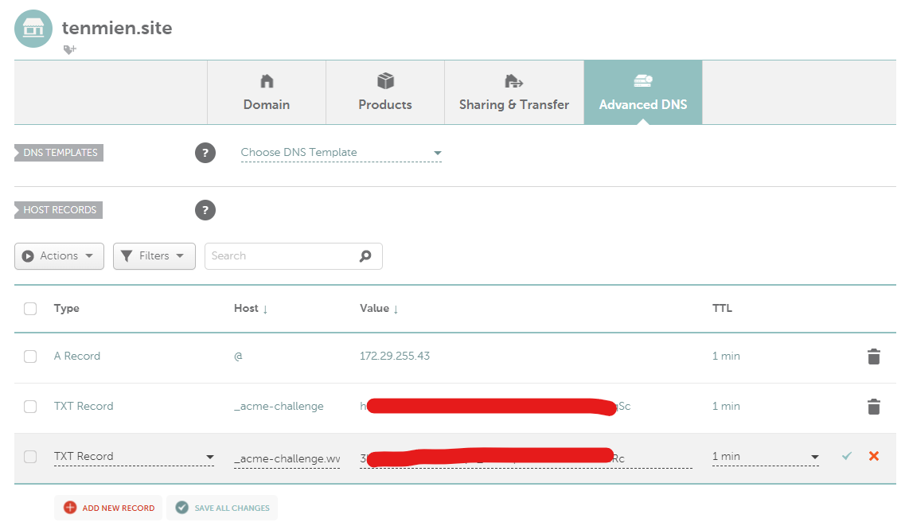

# Nginx reverse proxy with load balancing + setup SSL/TLS simple example
References:
* [reference 1](https://www.digitalocean.com/community/tutorials/openssl-essentials-working-with-ssl-certificates-private-keys-and-csrs)
* [reference 2](https://www.digitalocean.com/community/tutorials/how-to-create-a-self-signed-ssl-certificate-for-nginx-on-centos-7)
* [reference 3](https://docs.joshuatz.com/cheatsheets/security/self-signed-ssl-certs/)
* [SAN issue on windows](https://stackoverflow.com/questions/43665243/invalid-self-signed-ssl-cert-subject-alternative-name-missing)
## Self-signed certificate
* Setup self-signed ssl certificate:
    * Create a self-signed key and certificate pair:
        * Generate a private key and certificate signing request (CSR)
        ```
        sudo openssl req -newkey rsa:2048 -nodes -keyout tls/nginx-selfsigned.key -out tls/nginx-selfsigned.csr -config csr.conf
        ```
        * Generate a self-signed certificate from private key and CSR
        ```
        sudo openssl x509 -signkey tls/nginx-selfsigned.key -in tls/nginx-selfsigned.csr -req -days 365 -out tls/nginx-selfsigned.crt
        ```
        * 2-in-1: Create a private key and self-signed certificate
        ```
        sudo openssl req -x509 -nodes -days 365 -newkey rsa:2048 -keyout tls/nginx-selfsigned.key -out tls/nginx-selfsigned.crt -config crt.conf
        ```
    * Mount `nginx-selfsigned.crt` and `nginx-selfsigned.key` into nginx container
* Deploy: `docker compose up -d`
* Test connection
    * (For ubuntu) Install certificate
    ```
    sudo cp tls/nginx-selfsigned.crt /usr/local/share/ca-certificates
    sudo update-ca-certificates --fresh
    ```
    * Add the following entry in `/etc/hosts`
    ```
    127.0.0.1       tenmien.site
    ```
    * Test with curl
    ```
    curl https://tenmien.site/path1
    ```
## Getting certificate from Let's Encrypt manually with certbot
* References:
    * [reference 1](https://community.letsencrypt.org/t/my-server-provided-me-csr-to-get-ssl-from-letsencrypt/152371/4)
    * [reference 2](https://letsencrypt.org/docs/challenge-types/#dns-01-challenge)
* Purchase a domain name from a domain registrar (e.g. namecheap)
* Generate a private key and certificate signing request (CSR)
```
sudo openssl req -newkey rsa:2048 -nodes -keyout tls/domain.key -out tls/domain.csr -config csr.conf
```
* Getting certificate
    * Run a certbot container
    ```
    docker run -it --rm -v `pwd`/tls:/tls --entrypoint "/bin/sh" certbot/certbot
    ```
    * Manually obtain a certificate from Let's Encrypt with a CSR file and validate domain ownership using DNS records
    ```
    cd /tls
    certbot certonly --manual --csr domain.csr --preferred-challenges dns-01 --register-unsafely-without-email
    ```
    * Complete DNS challenge: create a DNS TXT record to complete the challenge
    
    * Obtain 3 files `0000_cert.pem`, `0000_chain.pem` and `0001_chain.pem` -> use `0001_chain.pem` for certificate file
    * Mount `0001_chain.pem` and `domain.key` into nginx container
* Deploy: `docker compose up -d`
* Test connection
    * Create a DNS A record to map domain to local IP
    * Test with curl
    ```
    curl https://tenmien.site/path1
    ```

## Using webroot plugin
* References:
    * [reference 1](https://mindsers.blog/en/post/https-using-nginx-certbot-docker/)
    * [reference 2](https://letsencrypt.org/docs/challenge-types/#http-01-challenge)
* Purchase a domain name from a domain registrar and setup a DNS A record that points the domain to the webserver (publicly accessible) IP address
* Add a location block in nginx config to handle `/.well-known/acme-challenge/` route:
```
# nginx2.conf
server {
    listen 80;
    listen [::]:80;
    server_name tenmien.site www.tenmien.site;

    location /.well-known/acme-challenge/ {
        root /var/www/certbot;
    }

    location / {
        return 301 https://$server_name$request_uri;
    }
}
```
* Comment out the server block that handles https (because we don't have the certificate yet):
```
server {
    listen 443 ssl; # Listen on port 443 using SSL/TLS
    listen [::]:443 ssl; 

    server_name tenmien.site www.tenmien.site; # Restrict access to this hostname

    ssl_certificate /etc/nginx/ssl/live/tenmien.site/fullchain.pem;   # SSL certificate file path
    ssl_certificate_key /etc/nginx/ssl/live/tenmien.site/privkey.pem;  # SSL certificate key file path
        
    location /path1 {
        rewrite ^/path1(.*) /$1 break; # remove `path1` part
        proxy_pass http://service1;
        proxy_set_header Host $http_host;
        proxy_set_header X-Real-IP $remote_addr;
        proxy_set_header X-Forwarded-For $proxy_add_x_forwarded_for;
        proxy_set_header X-Forwarded-Proto $scheme;
    }

    location /path2 {
        rewrite ^/path2(.*) /$1 break; # remove `path2` part
        proxy_pass http://service2;
        proxy_set_header Host $http_host;
        proxy_set_header X-Real-IP $remote_addr;
        proxy_set_header X-Forwarded-For $proxy_add_x_forwarded_for;
        proxy_set_header X-Forwarded-Proto $scheme;
    }
}
```
* `docker compose -f docker-compose2.yml up -d`
* Exec into certbot container and run
```
certbot certonly --webroot --webroot-path /var/www/certbot/ -d tenmien.site
```
Obtain `privkey.pem` for `ssl_certificate_key` and `fullchain.pem` for `ssl_certificate`
* Exec into nginx container, uncomment the https server block and reload:
```
nginx -s reload
```
* Test with curl
```
curl https://tenmien.site/path1
```
* Renew certificate: exec into certbot container and run
```
certbot renew
```